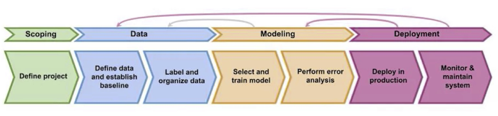
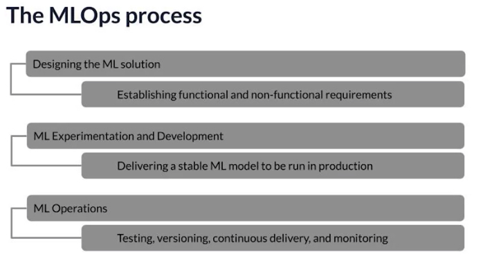

# Overview

Key: Build and deploy a machine learning model

MLOps (Machine Learning Operations): emerging discpline, and
comprises a set of tools and principles to support progress
through the ML project lifecycle. Consist of (1) Deployment
(2) Modelling (3) Data, including scoping

Key misunderstanding: challenge in deploying a model is not
just a software engineering issue. There is specific issues
related to machine learning models as well.

- Data drift (handling the change in data)

Instructors

1. Rober Crowe - Tensorflow Engineer, Google
2. Laurence Moroney, Leader AI Advocacy, Google

# Machine Learning Product Lifecycle

What do I do after training model? Production!

Proof of concept: model works in the model creation process
(trained with a local dataset)

## Issues in Deployment, an example

Manufacturing ML deployment Components:

- Objective: Detect defects in phone production
- Edge device: Device in the factory
- Inspection software: Investigate if defect presents
    - Controls a camera
    - Pass the photo to prediction server
    - Prediction server return the prediction
    - Control software if to continue production
    - Could be in cloud or in `Edge device`

Issue in deployment:

- Data drift, Concept drift
  - Lighting condition changes in deployment
- Proof of Concept to Production Gap
  - Requires more than machine learning codes
  - But ML code only occupy ~5% of the ML project code
  - E.g. Configuration, Data Collection, Data Verification,
    Machine Resource Management, Analysis Tools, Feature
    Extraction, Process Management Tools, Serving
    Infrastructure, Monitoring
  - [D. Sculley et al. NIPS: 2015: Hidden Technical Debt in
    Machine Learning Systems]

## Steps of an ML Project

1. Scoping
   - Define project
   - What is the X and y
2. Data
   - Define data and establish baseline
   - Label and Organize data
3. Modelling
   - Select and train model
   - Perform error analysis
4. Deployment
   - Deploy in production
   - Monitor & maintain system

Note:

- Step 2 to 4 are iterative procedures, after deployment if
  there is a data drift then model needs to be updated.
  Similarity, more data might be needed to train the model.

## Case study: speech recognition

1. Scoping
   - Voice search
   - Key metrics: Accuracy, latency, throughput
   - Estimate resources and timeline
2. Data: define data
   - Is the data labeled consistently? There might be
     different ways to label the data, the data has to be
     consistent in order to "learn" the data.
   - Require standardisation
   - How much silence before/after each clip?
   - How to perform volume normalization? And a mix of
     volume
   - Many of the current development is based on fixed
     dataset, and changing the model
   - In production, data does not have to be fix, it
     can be fixed ;)
3. Modelling
   - Building model require:
       - Code (algo/model)
       - Hyper parameters
       - Data
   - Issue:
     - Research/Academia: change code and hyper-parameters,
       keep data fixed
     - Product team: change hyper-parameters and data,
       keep model unchanged
     - ML system: code + data + hyper-parameters
       - Many deployment can benefit from using
         off-the-shelve models, but change the data
       - Use error analysis to understand what data is
         required, and what data needs to be fix
4. Deployment
   - Edge device (e.g. mobile phone)
   - Local software & Prediction server
     - Microphone -> VAD (voice activity detection) module
       -> Speech API -> Transcript + Search results
   - Issue: Concept draft/ Data draft
     - Data trained on adult voices, but younger voice sound
       different
