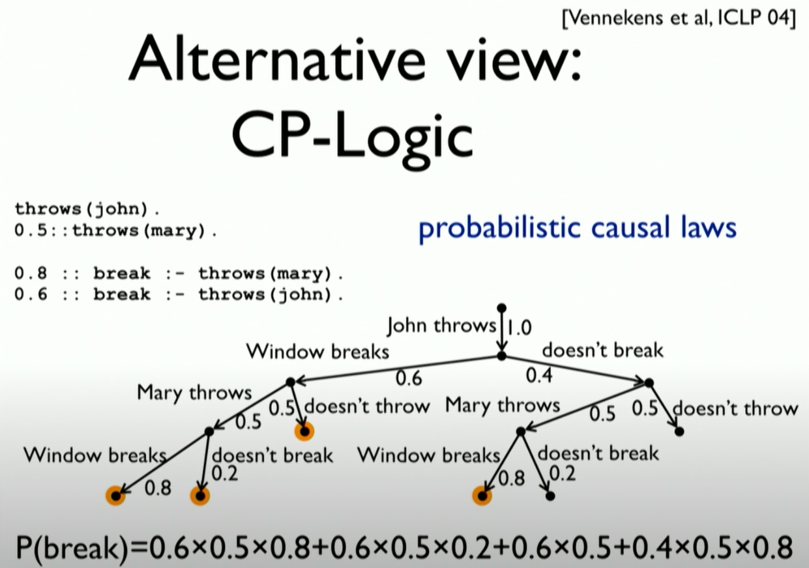
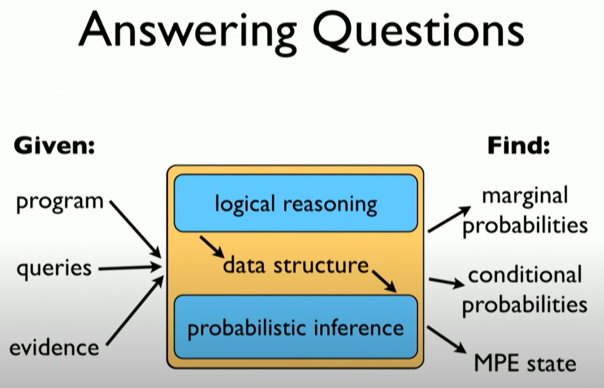
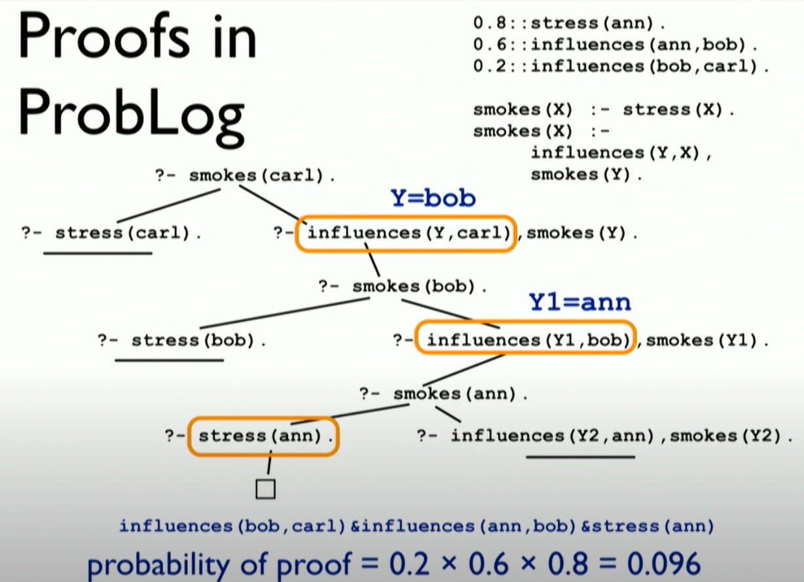

## Layman overview

Probabilistic logic first models the different probabilistic facts then
apply logical deduction to investigate if the statement is true, while
also computing the probability the statement is true.

From this presentation, the probabilistic logic differs from Monte Carlo
Sampling methods as each of the possible events are actually computed,
then assigned a probability. Therefore, the resultant extensive form of
the logic decision is known. The result is computed from the logic tree
and not through sampling. In other words, asking the same question twice
will get the same probability.

The challenge now comes in (1) modelling the probabilistic choices (2)
computing the probability of events

## Overview

Probabilistic Logics

-   Combined probabilistic choices and their consequences
-   Investigate the probability distribution over possible worlds, in a
    probabilistic databases

Key idea to take note is: probabilistic logic is not sampling, it’s is a
logical deduction step. Although sampling can be used as well.

[Online tutorial](http://dtai.cs.kuleuven.be/problog)

## An example

Context

-   toss (biased) coin and draw ball from each urn (containing red,
    blue, green)
-   win if (heads and a red ball) or (two balls of same color)

Key ingredients

-   Probabilistic fact
    -   0.4 :: heads
    -   Heads is true with probability 0.4
-   Annotated disjunction
    -   0.3 :: col(1, red); 0.7 :: col(1, blue).
    -   First ball is read with probability 0.3 and blue with 0.7
    -   0.2 :: col(2, red); 0.3 :: col(2, green); 0.5 :: col(2, blue).
    -   second ball is red with probability 0.2, green with 0.3, and
        blue with 0.5
-   Logical rule
    -   Encoding background knowledge
    -   win :- heads, col(\_, red).
    -   win :- col(1, C), col(2, C).

Summarises into

-   Probabilistic choices
    -   0.4 :: heads
    -   0.3 :: col(1, red); 0.7 :: col(1, blue).
    -   0.2 :: col(2, red); 0.3 :: col(2, green); 0.5 :: col(2, blue).
-   Consequences
    -   win :- heads, col(\_, red).
    -   win :- col(1, C), col(2, C).

## Questions

-   Marginal probability: probability of win
-   Conditional probability: probability of win given col(2, green)
-   MPE inference: Most probable world where win is true

## Answering the Questions

1.  Generating all possible outcomes
    -   Generates the possible “worlds” with the given probabilistic
        choices and investigate the percentage of consequences
    -   MPE inference: event with the highest likelihood of winning
    -   Marginal probability: sum of favourable events
    -   Conditional probability: using Bayes rule
    -   
2.  CP-Logic
    -   Similar to Game theory extensive form
    -   

## Programming

Working out the various possible worlds is infeasible in practical
problems. A systematic programming is required to solve the questions.

-   Logical reasoning
    -   Knowledge compilation
        1.  Using proofs
        2.  Using models

Example with using proofs

1.  Logic tree
    -   
2.  Probabilistic of proof
    -   
