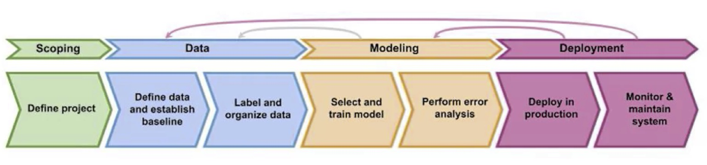
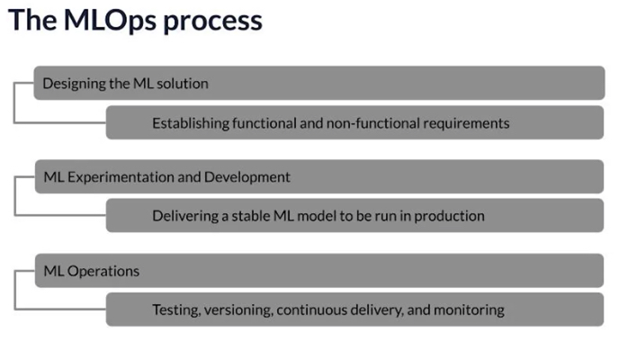

# Overview

Key: Build and deploy a machine learning model

MLOps (Machine Learning Operations): emerging discpline, and comprises a
set of tools and principles to support progress through the ML project
lifecycle. Consist of (1) Deployment (2) Modelling (3) Data, including
scoping

Key misunderstanding: challenge in deploying a model is not just a
software engineering issue. There is specific issues related to machine
learning models as well.

-   Data drift (handling the change in data)

Instructors

1.  Rober Crowe - Tensorflow Engineer, Google
2.  Laurence Moroney, Leader AI Advocacy, Google

# Machine Learning Product Lifecycle

What do I do after training model? Production!

Proof of concept: model works in the model creation process (trained
with a local dataset)

## Issues in Deployment, an example

Manufacturing ML deployment Components:

-   Objective: Detect defects in phone production
-   Edge device: Device in the factory
-   Inspection software: Investigate if defect presents
    -   Controls a camera
    -   Pass the photo to prediction server
    -   Prediction server return the prediction
    -   Control software if to continue production
    -   Could be in cloud or in `Edge device`

Issue in deployment:

-   Data drift, Concept drift
    -   Lighting condition changes in deployment
-   Proof of Concept to Production Gap
    -   Requires more than machine learning codes
    -   But ML code only occupy ~5% of the ML project code
    -   E.g. Configuration, Data Collection, Data Verification, Machine
        Resource Management, Analysis Tools, Feature Extraction, Process
        Management Tools, Serving Infrastructure, Monitoring
    -   \[D. Sculley et al. NIPS: 2015: Hidden Technical Debt in Machine
        Learning Systems\]

## Steps of an ML Project

1.  Scoping
    -   Define project
    -   What is the X and y
2.  Data
    -   Define data and establish baseline
    -   Label and Organize data
3.  Modelling
    -   Select and train model
    -   Perform error analysis
4.  Deployment
    -   Deploy in production
    -   Monitor & maintain system

Note:

-   Step 2 to 4 are iterative procedures, after deployment if there is a
    data drift then model needs to be updated. Similarity, more data
    might be needed to train the model.

## Case study: speech recognition

1.  Scoping
    -   Voice search
    -   Key metrics: Accuracy, latency, throughput
    -   Estimate resources and timeline
2.  Data: define data
    -   Is the data labeled consistently? There might be different ways
        to label the data, the data has to be consistent in order to
        “learn” the data.
    -   Require standardisation
    -   How much silence before/after each clip?
    -   How to perform volume normalization? And a mix of volume
    -   Many of the current development is based on fixed dataset, and
        changing the model
    -   In production, data does not have to be fix, it can be fixed ;)
3.  Modelling
    -   Building model require:
        -   Code (algo/model)
        -   Hyper parameters
        -   Data
    -   Issue:
        -   Research/Academia: change code and hyper-parameters, keep
            data fixed
        -   Product team: change hyper-parameters and data, keep model
            unchanged
        -   ML system: code + data + hyper-parameters
            -   Many deployment can benefit from using off-the-shelve
                models, but change the data
            -   Use error analysis to understand what data is required,
                and what data needs to be fix
4.  Deployment
    -   Edge device (e.g. mobile phone)
    -   Local software & Prediction server
        -   Microphone -&gt; VAD (voice activity detection) module -&gt;
            Speech API -&gt; Transcript + Search results
    -   Issue: Concept draft/ Data draft
        -   Data trained on adult voices, but younger voice sound
            different

# Deployment

Challenges: (1) statistical issues (2) software issues

-   Concept drift and Data drift
    -   Concept drift: x → y
    -   Data drift: *x*
    -   Another example: Speech recognition
        -   Training set: purchased data, historical data
        -   Test set: few months ago data (recency)
        -   Question: has data changed over time? Due to changes in
            languages, mic?
    -   Type of changes:
        -   Gradual changes: e.g. vocab changes over time
        -   Sudden shock: e.g. COVID changes purchase behaviour
            drastically such as credit card
-   Software engineering issues
    -   Implementation checklist
        -   Real-time or Batch? E.g. how slow can you afford for
            inference
        -   Cloud vs Edge/Browser? E.g. even when internet is
            disconnected the model can continue to function
        -   Compute resources (CPU/GPU/memory)? E.g. How much resource
            do you want at prediction service?
        -   Latency, throughout (QPS, query per second)? E.g. Speech has
            a longest latency requirement of 500ms
        -   Logging? E.g. logging data, experiment for re-training and
            debugging
        -   Security and privacy?

Task: (1) first deployment: writing software to deploy (2) maintenance:
update model when concept/data drift happened

## Deployment patterns

Common deployment cases

-   New product/capability
    -   Start small amount of traffic then drive up
-   Automate/assist with manual task
    -   E.g. built on existing manual inspection
-   Replace previous ML system

Key ideas:

1.  Gradual ramp up with monitoring
    -   Instead of spending massive traffic at the start, send small
        traffic then built up
2.  Rollback
    -   In the event the deployment failed

Type of deployment

-   Shadow mode deployment
    -   ML system shadows the human and runs in parallel
    -   ML system’s output not used for any decisions during this phase
    -   Ensure to gather learning data to compare against the human
        decision, and based on the data decide if ML algo can replace
        human
-   Canary deployment
    -   Roll out to small fraction (e.g. 5%) of traffic initially
    -   Monitor system and ramp up traffic gradually
-   Blue green deployment
    -   Old: blue version, New: green version
    -   Have router send data to blue version, when switching send the
        data to green version
    -   Advantage: easy way to enable rollback using the router to
        re-route to the blue version
    -   You can use more gradual switching as well

Degrees of automation

-   Not a 0 or 1, but a degree of automation
-   Human only &gt; Shadow mode &gt; AI assistance &gt; Partial
    automation (only accept subset of results, e.g. do not accept a
    confident prediction) &gt; Full automation
-   You can choose to stop in any stages and does not have to go full
    automation
    -   Human in the loop: AI assistance, Partial automation
    -   Full AI: massive data e.g. consumer search, that is impossible
        to have human in the loop

## Monitoring

-   Monitoring dashboard
    -   Server load
    -   Fraction of non-null outputs
    -   Fraction of missing input values
    -   Brainstorm the things that could go wrong, and brainstorm a few
        statistics/metrics that will detect that problem
    -   It’s okay to start with many metrics initially and gradually
        remove metrics not useful
    -   Software metrics: memory, compute, latency, throughput, server
        load
    -   Input metrics (X): average input length, average input volume,
        number of missing values, average image brightness
    -   Output metrics (y): \# times return null, \# times user redoes
        search, \# times user switches to typing, CTR
    -   Set a threshold to alarm the team to investigate for issues
-   Deployment is iterative process
    -   model: ML model/data -&gt; error analysis -&gt; Experiement
    -   deployment: deployment/monitoring -&gt; traffic -&gt;
        performance analysis
    -   Iterative process is required to choose the right set of metrics
        to monitor
    -   Adapt metrics and threshold over time
-   Model maintenance
    -   Manual re-training (more common now)
    -   Automatic re-training

## Pipeline monitoring

Multiple steps in a machine learning pipeline.

-   An example: speech recognition
    -   Audio -&gt; VAD (voice activity detection module, observe if
        anyone is speaking) -&gt; Speech recognition -&gt; Transcript
    -   VAD controls the amount of data transfer to server to ease
        server load
    -   Changes to VAD will affect the speech recognition as well
-   An example: user profile
    -   User data (e.g. clickstream) -&gt; user profile (e.g. own car? Y
        N unknown) -&gt; recommender system -&gt; product
        recommendations
    -   If clickstream data changes, user profile (if user owns a car)
        changes, producing more unknowns, will affect the
        recommendations

Useful move:

-   monitor metrics
-   how quickly do the data change?
    -   User data generally has slower drift
        -   e.g. appearance don’t change too fast, e.g. hairstyle
            changes
        -   But events such as COVID-19, or holiday will result in
            sudden change in user data
    -   Enterprise data (B2B) can shift fast
        -   e.g. manufacturing might change very fast e.g. new machine

# Readings

-   [Machine Learning in Production: Why You Should Care About Data and
    Concept
    Drift](https://towardsdatascience.com/machine-learning-in-production-why-you-should-care-about-data-and-concept-drift-d96d0bc907fb)
-   [Monitoring Machine Learning Models in
    Production](https://christophergs.com/machine%20learning/2020/03/14/how-to-monitor-machine-learning-models/)
-   [Video: A Chat with Andrew on MLOps: From Model-centric to
    Data-centric AI](https://www.youtube.com/watch?v=06-AZXmwHjo)
-   [Paper: Konstantinos, Katsiapis, Karmarkar, A., Altay, A., Zaks, A.,
    Polyzotis, N., … Li, Z. (2020). Towards ML Engineering: A brief
    history of TensorFlow Extended
    (TFX)](http://arxiv.org/abs/2010.02013)
-   [Paleyes, A., Urma, R.-G., & Lawrence, N. D. (2020). Challenges in
    deploying machine learning: A survey of case
    studies.](http://arxiv.org/abs/2011.09926)
-   [Sculley, D., Holt, G., Golovin, D., Davydov, E., & Phillips, T.
    (n.d.). Hidden technical debt in machine learning systems. Retrieved
    April 28, 2021, from
    Nips.c](https://papers.nips.cc/paper/2015/file/86df7dcfd896fcaf2674f757a2463eba-Paper.pdf)

[Deployment
lab](https://github.com/https-deeplearning-ai/machine-learning-engineering-for-production-public/tree/main/course1/week1-ungraded-lab)
